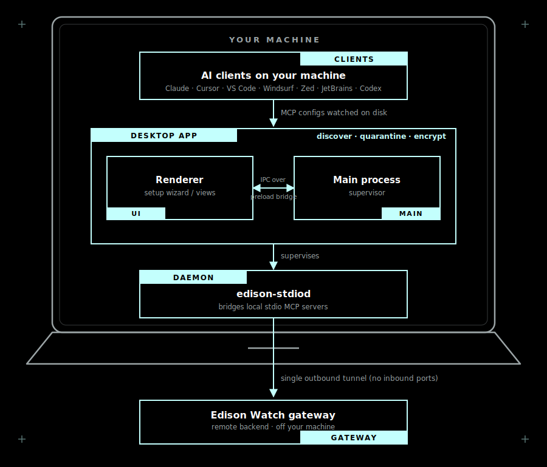

<div align="center">

# Edison Watch - Desktop

<b>The local control plane for your AI tools' MCP servers - discover, quarantine, and encrypt, all from your menu bar.</b>

<p>
  <a href="#what-it-does">What it does</a> •
  <a href="#getting-started">Getting Started</a> •
  <a href="#installation">Installation</a> •
  <a href="#build-from-source">Build from source</a> •
  <a href="#how-it-works">How it works</a> •
  <a href="#architecture">Architecture</a> •
  <a href="#credits">Credits</a>
</p>

[](./LICENSE)
[](https://www.electronjs.org/)
[](#installation)
[](https://github.com/Edison-Watch/desktop/actions/workflows/build-macos.yml)

</div>

<!--
  TODO: add a hero screenshot or GIF of the setup wizard / main view here, e.g.
  <div align="center"></div>
-->

---

Edison Watch Desktop is the local control plane for [Edison Watch](https://edison.watch) that governs the [MCP](https://modelcontextprotocol.io/) servers wired into your AI tools, using a menu-bar app that watches every client on your machine. It discovers the servers your AI clients have configured, quarantines risky or unapproved ones before they can run, encrypts their credentials with zero-knowledge keys, and bridges local servers to the Edison Watch gateway through a single outbound tunnel. Built for developers who run MCP servers across many AI clients and want one place to see and control them all.

Discover → review → approve → encrypt → bridge, without secrets ever leaving your device in the clear.

> [!WARNING]
> **Edison Watch Desktop is experimental software under active development** and has **not** had an independent security audit. It is a **client for the Edison Watch platform** - it requires an Edison Watch account and connects to the Edison backend. UI, on-disk formats, and behavior may change before a 1.0 release.

## What it does

Modern AI tools (Claude, Cursor, VS Code, and friends) connect to MCP servers that can read your files, hold credentials, and reach the network. They're configured in a dozen different places and are easy to lose track of. Edison Watch Desktop gives you one place to see and control them:

- **Discover** - every MCP server configured across the AI clients installed on your machine, with no manual inventory.
- **Quarantine** - newly-appeared or unapproved servers ("shadow MCPs") before they can run, with a review-and-approve flow.
- **Encrypt** - credentials with zero-knowledge keys (personal and organization), so secrets never leave your device in the clear.
- **Bridge** - local stdio MCP servers to the Edison Watch gateway through the bundled [`edison-stdiod`](https://github.com/Edison-Watch/stdiod) daemon: a single outbound, no-inbound-ports tunnel, so they're reachable and governed without being exposed.
- **Stay current** - with in-app auto-updates.

### Supported AI clients

Claude Code · Claude Desktop · Claude Cowork · Cursor · VS Code · Windsurf · Zed · JetBrains IDEs · Codex

## Getting Started

1. **Install** the app - see [Installation](#installation) (or [build from source](#build-from-source) until signed installers ship).
2. **Launch** it - the app lives in your menu bar / system tray. A setup wizard walks you through signing in, connecting your installed AI clients, and setting up encryption.
3. **Review** - from then on the app watches your clients' MCP configuration, surfaces changes for approval, and keeps the tunnel to the Edison Watch backend healthy.

New to MCP? See the [Model Context Protocol docs](https://modelcontextprotocol.io/).

## Installation

> [!NOTE]
> Prebuilt, signed installers will be published on the [Releases](https://github.com/Edison-Watch/desktop/releases) page. Until then, [build from source](#build-from-source).

| Platform | Format |
| --- | --- |
| macOS | `.dmg` (universal - Apple Silicon + Intel) |
| Windows | `.exe` installer (x64, arm64) |
| Linux | `.AppImage` (x64, arm64) |

## Build from source

TLDR: `git clone` → `npm install` → `npm run dev`.

<details>
<summary>⚙️ Building from source</summary>

You'll need [Node.js 22+](https://nodejs.org/) and npm. The app depends on [`@edison-watch/shared`](https://www.npmjs.com/package/@edison-watch/shared), published to npm, so a plain clone and install pulls everything in:

```sh
git clone https://github.com/Edison-Watch/desktop.git
cd desktop
npm install
```

Then:

```sh
npm run dev          # run the app in development with hot reload
npm run build        # typecheck + build the renderer/main/preload bundles
npm run typecheck    # typecheck only (node + web projects)
npm run test         # unit tests (vitest)
```

Packaging installers also bundles the `edison-stdiod` daemon and per-platform runtimes; see the `build:mac` / `build:win` / `build:linux` scripts in [`package.json`](./package.json) and the helpers under [`scripts/`](./scripts).

</details>

## How it works

The app runs in your menu bar / system tray and supervises the bundled `edison-stdiod` daemon. On first launch a setup wizard walks you through signing in, connecting your installed AI clients, and setting up encryption. From then on it watches your clients' MCP configuration, surfaces changes for review, and keeps the tunnel to the Edison Watch backend healthy.

## Architecture

TLDR: AI clients → Edison Watch Desktop (discover · quarantine · encrypt) → `edison-stdiod` → single outbound tunnel → Edison Watch gateway.

<div align="center">
  
</div>

The diagram captures the durable component boundaries - the Electron process model and the trust/network boundaries - not the on-disk layout, which is free to change. Everything except the Edison Watch gateway runs locally on your machine.

<details>
<summary>ASCII version</summary>

Rendered as ASCII so it shows up anywhere the SVG doesn't.

```
        AI clients on your machine
        (Claude · Cursor · VS Code · …)
                     │
                     │  MCP configs watched on disk
                     ▼
   ┌─────────────────────────────────────────────┐
   │             Edison Watch Desktop             │
   │                                              │
   │   ┌─────────────┐   IPC over    ┌─────────┐  │
   │   │ Renderer UI │◀── preload ──▶│  Main   │  │  discover · quarantine · encrypt
   │   │ (wizard /   │    bridge     │ process │  │
   │   │  views)     │               │         │  │
   │   └─────────────┘               └────┬────┘  │
   └────────────────────────────────────┼────────┘
                                         │  supervises
                                         ▼
                              ┌──────────────────┐
                              │  edison-stdiod    │  bridges local stdio MCP servers
                              │  daemon           │
                              └─────────┬────────┘
                                        │  single outbound tunnel (no inbound ports)
                                        ▼
                              Edison Watch gateway
```

</details>

## Environment Variables

TLDR: Code-signing secrets for release builds (see [`.env.example`](./.env.example)); dev toggles for local runs.

<details>
<summary>Expand</summary>

Release / code-signing (macOS):

| Variable | Description |
|----------|-------------|
| `CSC_LINK` | Path or base64 of the Developer ID signing certificate |
| `CSC_KEY_PASSWORD` | Password for the signing certificate |
| `APPLE_ID` | Apple ID used for notarization |
| `APPLE_APP_SPECIFIC_PASSWORD` | App-specific password for notarization |
| `APPLE_TEAM_ID` | Apple Developer Team ID |

Development / runtime toggles:

| Variable | Description |
|----------|-------------|
| `EDISON_DRY_RUN` | Set to `1` to short-circuit the `edison-stdiod` daemon (used by Playwright/Storybook/tests) |
| `EDISON_DEBUG_RENDERER` | Set to `true` to open the renderer DevTools on launch |
| `EW_UPDATE_TEST` / `EW_UPDATE_FEED` | Point auto-update at a local feed for testing without publishing |

</details>

## Related repositories

- [**Edison-Watch/stdiod**](https://github.com/Edison-Watch/stdiod) - the `edison-stdiod` tunnel daemon bundled with this app.
- [**Edison-Watch/shared**](https://github.com/Edison-Watch/shared) - shared React components, design tokens, and client utilities, consumed here as the [`@edison-watch/shared`](https://www.npmjs.com/package/@edison-watch/shared) npm package.

## Security

Please **do not** report security issues through public GitHub issues or pull requests. Report privately via the repository's **Security** tab ("Report a vulnerability") or by emailing <security@edison.watch>.

## Contributing

Issues and focused pull requests are welcome. Please keep changes small and run `npm run typecheck` and `npm run test` before opening a PR.

## Credits

This software is built with:

- [Electron](https://www.electronjs.org/) - cross-platform desktop runtime
- [electron-vite](https://electron-vite.org/) - build tooling
- [React 19](https://react.dev/) - renderer UI
- [Tailwind CSS](https://tailwindcss.com/) - styling
- [Storybook](https://storybook.js.org/) - component development
- [Playwright](https://playwright.dev/) + [Vitest](https://vitest.dev/) - end-to-end and unit testing
- [prek](https://github.com/j178/prek) - Rust-based pre-commit framework

## About the Core Contributors

<a href="https://github.com/Edison-Watch/desktop/graphs/contributors">
  
</a>

Made with [contrib.rocks](https://contrib.rocks).

## License

Licensed under the [GNU Affero General Public License v3.0](./LICENSE).
